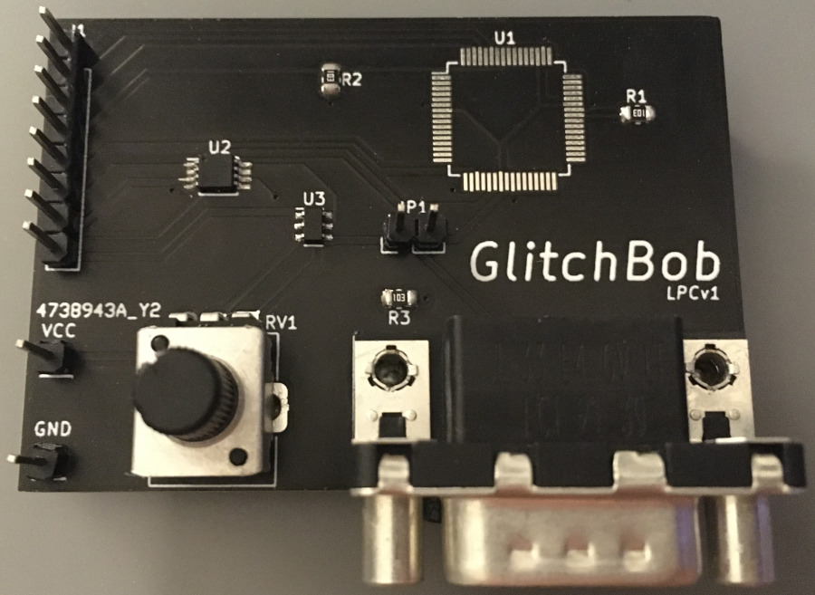

# GlitchBob LPC

Voltage glitching automation tool to break protection on NXP LPC microcontrollers.

The glitch circuit can be controlled by a Raspberry Pi Pico or other low-cost development board.

## TODO

These are issues identified in the prototype:

- Add bypass caps to all ICs.
- Add pull-up resistor to `74LVC1G3157` switch input.
- Add pull-down resistors to `74LVC2G66` switch inputs.
- Move target closer to I/O header to reduce the trace length for the oscillator I/O.
    - Shorter traces have lower impedance and will be capable of faster clock frequency (up to target max, e.g. 12 MHz).
- The potentiometer polarity is swapped.
    - 0v should be fully counterclockwise, and +VCC should be fully clockwise.
- The potentiometer is upside down.
    - Rotate the footprint 180 degrees.
- No good place to put the rubber feet.
    - Move through-hole components or find smaller feet.
- Still has some wasted surface area with traces spread out.
    - Change 8-pin header pinout to optimize routing.
    - Move traces closer together to prevent ground plane islands.
- `R3` is a bit too close to the serial port.
    - Move `R3` so it is more easily reachable for assembly.

And this is a wish-list for improvements:

- Replace 8-pin header with Raspberry Pi Pico header footprint.
- Add a 7-segment display for glitch-voltage display and other info.
    - 7-Segment driver can be inexpensively built with:
        - [`74LVC244`](https://www.mouser.com/ProductDetail/Texas-Instruments/SN74LVC244APWR?qs=DcvZ7Fltd5xns%252BvAsbES0A%3D%3D) or [`74HC244`](https://www.mouser.com/ProductDetail/Nexperia/74HC244PW118?qs=sGAEpiMZZMutXGli8Ay4kE3wRMDwmh%2F%252B519e17hTwKc%3D) - Octal buffer/line-driver.
        - [`74LV4052`](https://www.mouser.com/ProductDetail/Nexperia/74LV4052PW118?qs=me8TqzrmIYXk9tz3ZPOozg%3D%3D) or [`74HC4052`](https://www.mouser.com/ProductDetail/Nexperia/74HC4052D653?qs=P62ublwmbi9dOtwH%252Bhrppg%3D%3D) - 4-channel analog multiplexer/demultiplexer.
        - [`LTC-5723HR`](https://www.mouser.com/ProductDetail/Lite-On/LTC-5723HR?qs=WxFF5lh7QM2ytJdX1EhJKQ%3D%3D) - 4-digit 7-segment display with common cathode.
- Optional ADC for potentiometer measurement.
    - Using Raspberry Pi Pico's ADC for target voltage up to 3.3v <code>VRL</code>.
    - A standalone ADC will allow a second power rail for the target voltage, e.g. up to 5v <code>VRL</code> with [`TLA2021`](https://www.mouser.com/ProductDetail/Texas-Instruments/TLA2021IRUGT?qs=sGAEpiMZZMtgJDuTUz7Xu52YdifX%2FxP9lhA%252BBqDZ7rN1fYamX3qf2A%3D%3D) - 12-bit ADC, I2C.
- Replacing the analog potentiometer with a digital encoder + DAC can allow finer adjustment of the glitch-voltage.
    - No ADC is required with this setup.
    - Fully software-controlled; E.g. allows ignoring rotations while automated search is running.
    - Example components:
        - [`PEC12R-4215F-S0024`](https://www.mouser.com/ProductDetail/Bourns/PEC12R-4215F-S0024?qs=pxDZlBjcsCiq%252B%252BLwoVCNNg%3D%3D) - Contact incremental encoder with switch, 2-bit quadrature code, 24 pulses per rotation.
        - [`1106`](https://www.mouser.com/ProductDetail/Davies-Molding/1106?qs=byeeYqUIh0Mr0LdKOAGzbA%3D%3D) Knob for encoder, black and blue.
        - [`MCP47CVB21`](https://www.mouser.com/ProductDetail/Microchip-Technology-Atmel/MCP47CVB21-E-MG?qs=sGAEpiMZZMtgJDuTUz7Xu2gekaVOgz%252BBwkrv3p3aJpfVVhvcYLmSXw%3D%3D) - 12-bit DAC, I2C.
    - Encoder switch can be used to change the sensitivity.
        - Debounce in software.
        - Operation is software controlled. E.g. push to switch to next in a list of two or more settings, push-and-hold to start automated search, etc.
        - Sensitivities are software controlled. E.g. 0.25v per pulse, 0.01v per pulse, etc. As low as <code>VRL/4096</code> (limited by DAC resolution).
